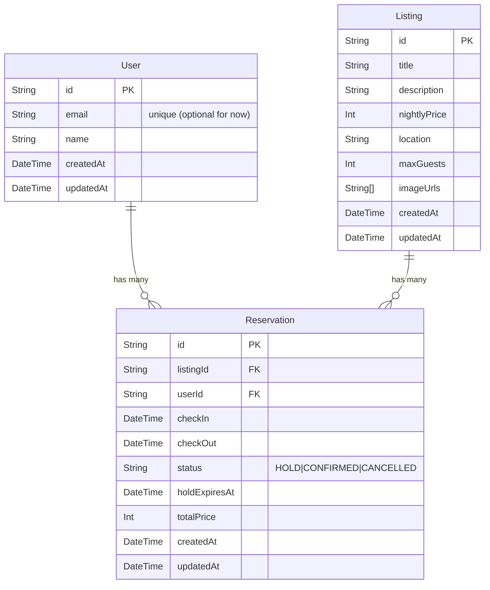

```mermaid
erDiagram
User ||--o{ Reservation : "has many"
Listing ||--o{ Reservation : "has many"

User {
String id PK
String email "unique (optional for now)"
String name
DateTime createdAt
DateTime updatedAt
}

Listing {
String id PK
String title
String description
Int nightlyPrice
String location
Int maxGuests
String[] imageUrls
DateTime createdAt
DateTime updatedAt
}

Reservation {
String id PK
String listingId FK
String userId FK
DateTime checkIn
DateTime checkOut
String status "HOLD|CONFIRMED|CANCELLED"
DateTime holdExpiresAt
Int totalPrice
DateTime createdAt
DateTime updatedAt
}
```
